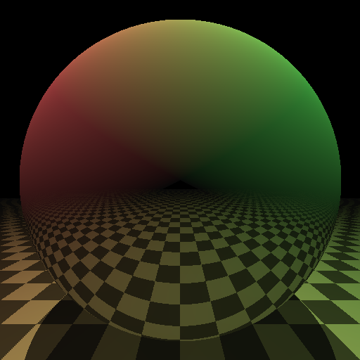

# CMake Ray Tracer

A simple ray tracer written in pure CMake. Inspired by [raytracer.hpp](https://github.com/tcbrindle/raytracer.hpp). More information can be found at [my blog](https://64.github.io/cmake-raytracer).



## Usage

The ray tracer writes its output to `stderr`, so you can use it with:

```
cmake . -Dimage_width=64 -Dimage_height=64 -Dnum_procs=4 2> image.ppm
```

Which writes the output to `image.ppm`. Then use an image viewer capable of opening PPM files (or [this](http://www.cs.rhodes.edu/welshc/COMP141_F16/ppmReader.html)) to view.

`num_procs` controls the number of worker processes spawned. It is recommended to set this to a value no greater than the number of cores in your CPU, for maximum performance.

For now, to keep the code simple, you are required to keep `image_width`, `image_height` and `num_procs` as powers of 2, otherwise the image may not be fully formed. If not specified, these arguments default to the values shown above.

## Performance

Using cmake 3.19.2 on Linux 5.4 on a i5-10210U (4 cores, 8 threads), running this command:

```
for X in 1 2 4 8 16 32 64 128 256 512 ; do echo SIZE $X ; time cmake . -Dimage_width=$X -Dimage_height=$X -Dnum_procs=8 2> image_size_${X}.ppm  ; done
```

Figures reported by `time` command below (reformatted).  As usual, the "real" time is the wall clock time.  The others are summed on all processors.

| size | real | user | sys |
| ---: | ---: | ---: | --: |
| 1	|    0,054s	|    0,130s	|    0,051s |
| 2	|    0,035s	|    0,098s	|    0,041s |
| 4	|    0,077s	|    0,274s	|    0,018s |
| 8	|    0,106s	|    0,460s	|    0,023s |
| 16	|    0,367s	|    1,871s	|    0,059s |
| 32	|    1,296s	|    7,617s	|    0,132s |
| 64	|    5,175s	|   29,455s	|    0,356s |
| 128	|   21,093s	| 2m06,299s	|    1,566s |
| 256	| 1m33,395s	| 9m21,875s	|    5,999s |
| 512	| 7m23,094s | 45m36,327s |   32,588s |

## Contributing

All contributions (issue, PRs) are welcome. This project is licensed under the MIT license.
